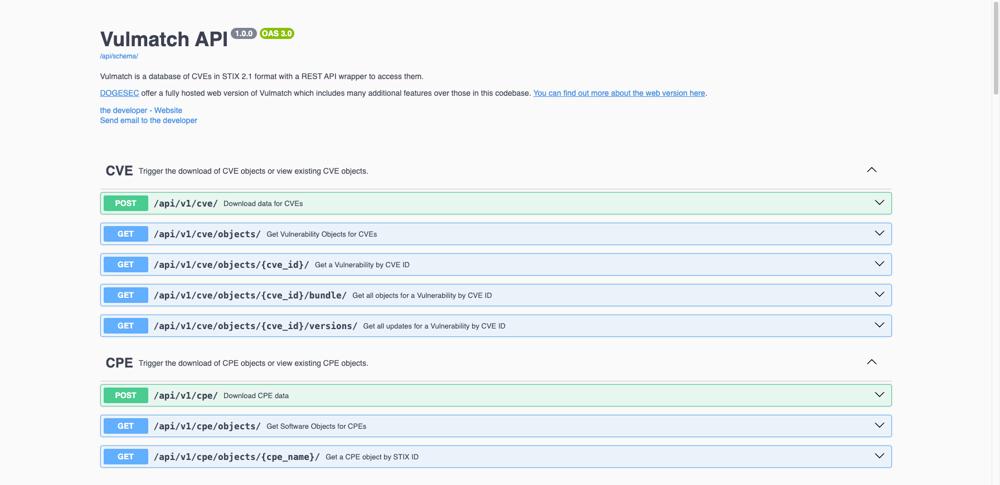

# Vulmatch

[](https://codecov.io/gh/muchdogesec/vulmatch)

## Before you begin...


We offer a fully hosted web version of Vulmatch which includes many additional features over those in this codebase. [You can find out more about the web version here](https://www.vulmatch.com/).

## Overview



Vulmatch is a database of CVEs in STIX 2.1 format with a REST API wrapper to access them.

Some common reasons people use Vulmatch include filtering CVEs by;

* CVSS
* EPSS
* CWE classifcation
* ATT&CK classification
* Affected products
* Know expliots

## Install

### Download and configure

```shell
# clone the latest code
git clone https://github.com/muchdogesec/vulmatch
```

### Pre-requisites

**IMPORTANT**: ArangoDB and Postgres must be running. These are not deployed in the compose file.

If you are not sure what you are doing here, [follow the basic setup steps here](https://community.dogesec.com/t/best-way-to-create-databases-for-obstracts/153/2).

### Configuration options

Vulmatch has various settings that are defined in an `.env` file.

To create a template for the file:

```shell
cp .env.example .env
```

To see more information about how to set the variables, and what they do, read the `.env.markdown` file.

### Build the Docker Image

```shell
sudo docker compose build
```

### Start the server

```shell
sudo docker compose up
```

### Access the server

The webserver (Django) should now be running on: http://127.0.0.1:8005/

You can access the Swagger UI for the API in a browser at: http://127.0.0.1:8005/api/schema/swagger-ui/

## Quickstart

To get up and running quickly head to `/utilities/README.md` for some scripts that will automate the backfill of data.

## Support

[Minimal support provided via the DOGESEC community](https://community.dogesec.com/).

## License

[Apache 2.0](/LICENSE).